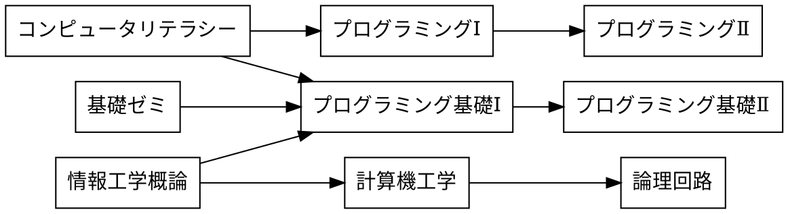

# マークダウンによる図の作成

講義資料と sample.md 内の記述を参考にして，exercise.md 内の4つの課題に回答せよ．

ex01.png



ex02.png

```plantUML
@startwbs uml01
* 拓殖大学
** 商学部
*** 経営学科
*** 国際ビジネス学科
*** 会計学科
** 政経学部
*** 法律政治学科
*** 経済学科
*** 社会安全学科
** 外国語学部
*** 英米語学科
*** 中国語学科
*** スペイン語学科
*** 国際日本語学科
** 工学部
*** 機械システム学科
*** 電子システム学科
*** 情報工学科
*** デザイン学科
** 国際学部
*** 国際学科
@endwbs
```


ex03.png

```plantUML
@startuml usecase01
left to right direction
actor "学生" as student
actor "教員" as faculty
rectangle {
    usecase "提出結果の採点" as A
    usecase "リモートリポジトリにpush" as B
    usecase "修正のコミット" as C
    usecase "修正をステージに上げる" as D
    usecase "課題ファイルの修正" as E
    usecase "リポジトリのクローン" as F
    usecase "課題の受領" as G
    usecase "課題の登録" as H
}
student --> B
student --> C
student --> D
student --> E
student --> F
student --> G
A <-- faculty
H <-- faculty
@enduml
```

ex04.png

```plantUML
@startwbs uml02
* 拓殖大学の人気食堂メニュー
** 麺類
*** 蕎麦
*** うどん
**** かけ揚げうどん
** カレー
*** カツカレー
*** ミニカレー
*** カレーライス
** 定食
*** おろしとんかつ
*** グルメランチ
*** 拓大ランチ
*** チキン南蛮
*** 日替わり定食
** どんぶり
*** 拓殖ギガ丼
*** 味噌カツ丼
*** 照り焼きチキン丼
@endwbs
```